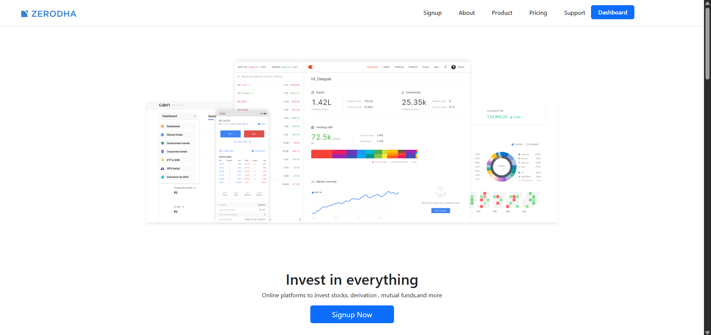
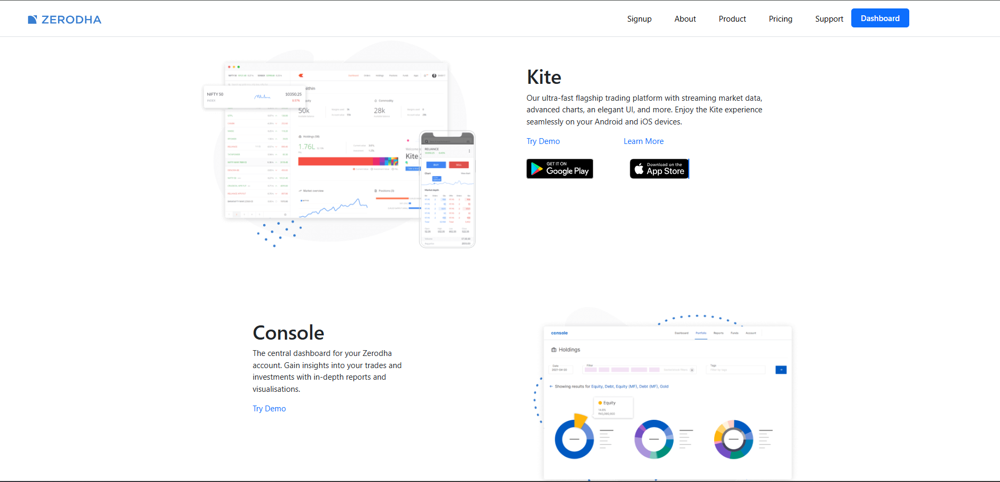
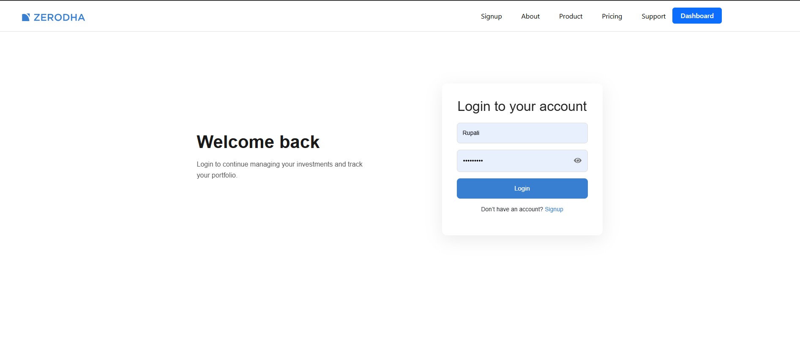
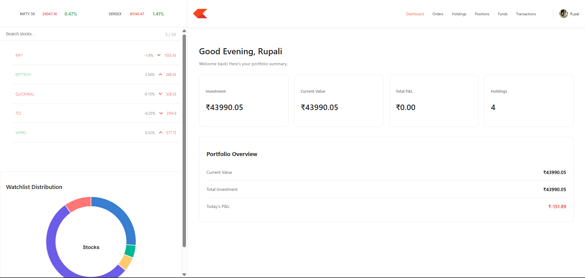
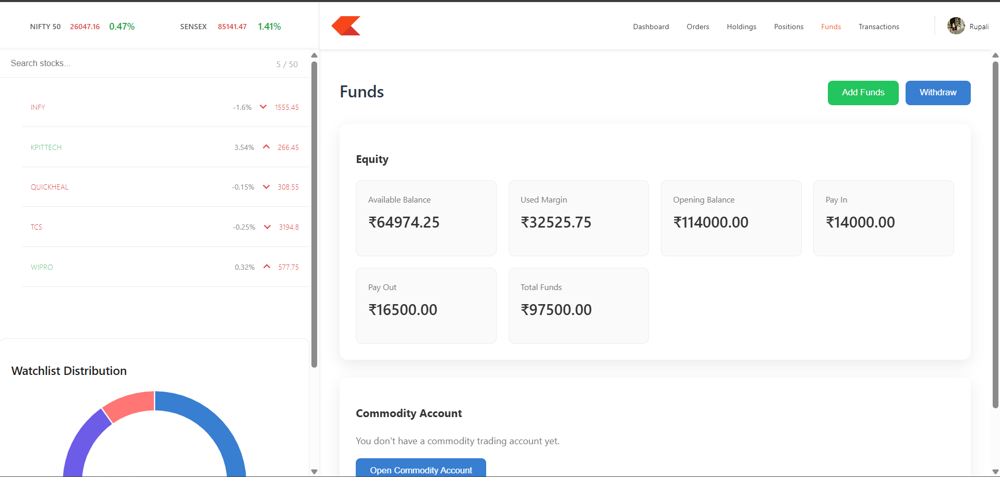
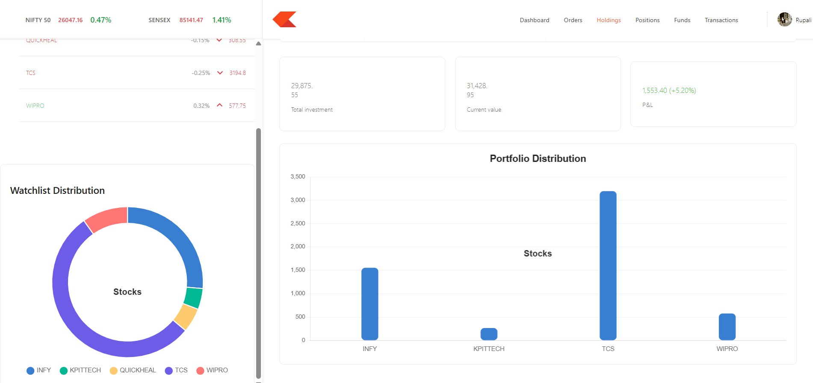
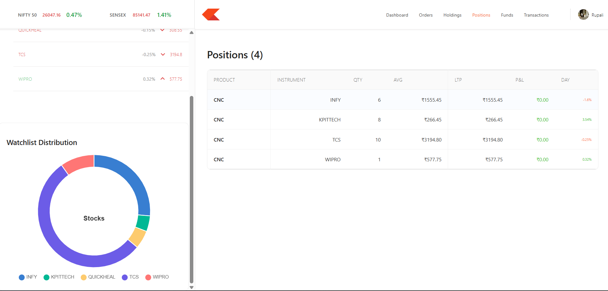
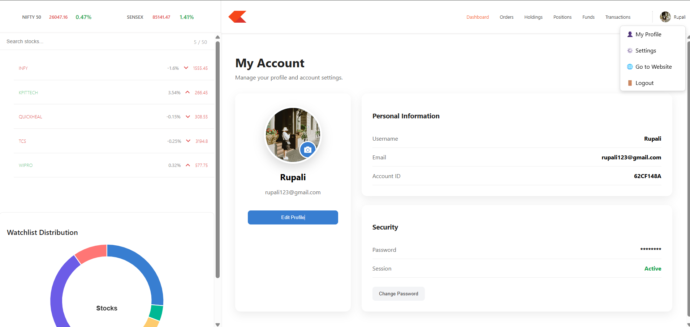
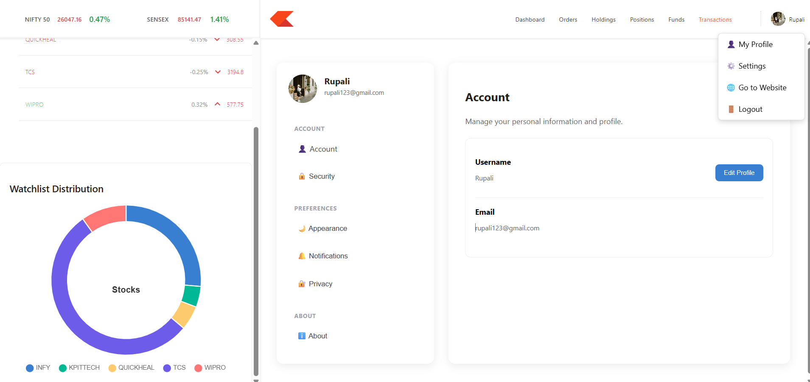

<div align="center">

# 📈 TradeHub

### A Full-Stack Stock Trading Platform Inspired by Zerodha


A modern stock trading platform where users can manage their portfolio, buy/sell stocks, maintain watchlists, track transactions, and visualize investments with interactive charts.

</div>

---

# Features

## Authentication

- User Registration
- Secure Login
- JWT Authentication
- Protected Dashboard
- Logout
- Persistent Sessions

---

## 👤 User Profile

- View Profile
- Edit Profile
- Change Password
- Update Profile Picture

---

## 📊 Dashboard

- Portfolio Summary
- Holdings Overview
- Investment Statistics
- Interactive Charts
- Profit/Loss Visualization

---

## 💹 Trading

- Buy Stocks
- Sell Stocks
- Order Confirmation
- Holdings Update
- Position Management

---

## Watchlist

- Search Stocks
- Add to Watchlist
- Remove from Watchlist
- Live Price Display
- Quick Buy/Sell Actions

---

## Funds

- View Available Balance
- Add Funds
- Withdraw Funds
- Fund History

---

## Transactions

- Buy History
- Sell History
- Deposit History
- Withdrawal History

---

## ⚙️ Settings

- Account Settings
- Security Settings
- Notification Settings
- Appearance Settings
- Privacy Settings
- About Section

---

# 📈 Interactive Charts

- Portfolio Bar Chart
- Doughnut Chart
- Holdings Distribution
- Stock Allocation Visualization

---

# 🛠 Tech Stack

## Frontend

- React.js
- React Router DOM
- Axios
- Bootstrap
- Material UI
- React Icons
- Chart.js

---

## Backend

- Node.js
- Express.js
- JWT Authentication
- Bcrypt
- Cookie Parser
- Multer
- Cloudinary

---

## Database

- MongoDB
- Mongoose

---

# 📂 Project Structure

```
TradeHub
│
├── backend
│   ├── controllers
│   ├── routes
│   ├── middlewares
│   ├── models
│   ├── schemas
│   └── config
│
├── frontend
│   ├── public
│   └── src
|       |__landing_page
│
├── dashboard
│   ├── components
│   ├── context
│   └── charts
│
└── README.md
```

---

# ⚡ Installation

## Clone Repository

```bash
git clone https://github.com/Prajakta174/TradeHub.git
```

---

## Backend

```bash
cd backend
npm install
npm index.js
```

---

## Frontend

```bash
cd frontend
npm install
npm start
```

Runs on

```
http://localhost:3000
```

---

## Dashboard

```bash
cd dashboard
npm install
npm start
```

Runs on

```
http://localhost:3001
```

---

# 🔑 Environment Variables

Create a `.env` file inside the backend folder.

```env
MONGO_URL=your_mongodb_connection_string

JWT_SECRET=your_secret_key

CLOUDINARY_CLOUD_NAME=your_cloud_name

CLOUDINARY_API_KEY=your_api_key

CLOUDINARY_API_SECRET=your_api_secret
```

---

# 📸 Screenshots

## Landing Page



---

## Product



---

## Login



---

## Dashboard



---

## Funds



---

## Holdings



## Profile

---

## Position



## Profile

---



---

## Settings



# 🔒 Security Features

- JWT Authentication
- Password Hashing using Bcrypt
- HTTP Only Cookies
- Protected Routes
- Authentication Middleware

---

# 📌 Future Improvements

- Live Stock Prices
- Portfolio Analytics
- Dark Mode
- Email Verification
- Password Reset
- Stock News Integration
- Real-time Notifications
- Mobile Responsive Improvements

---

# 👩‍💻 Author

### **Prajakta Dutonde**

Computer Science Engineering Student

MERN Stack Developer

Java | SQL | MongoDB | React | Node.js | Express

GitHub:
https://github.com/Prajakta174

---

# Show your support

If you like this project,

⭐ Star the repository

Fork it

Share it

---

<div align="center">

### Thank you for visiting TradeHub ❤️

</div>
